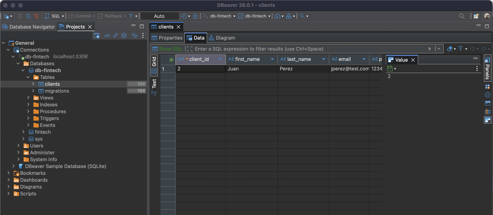
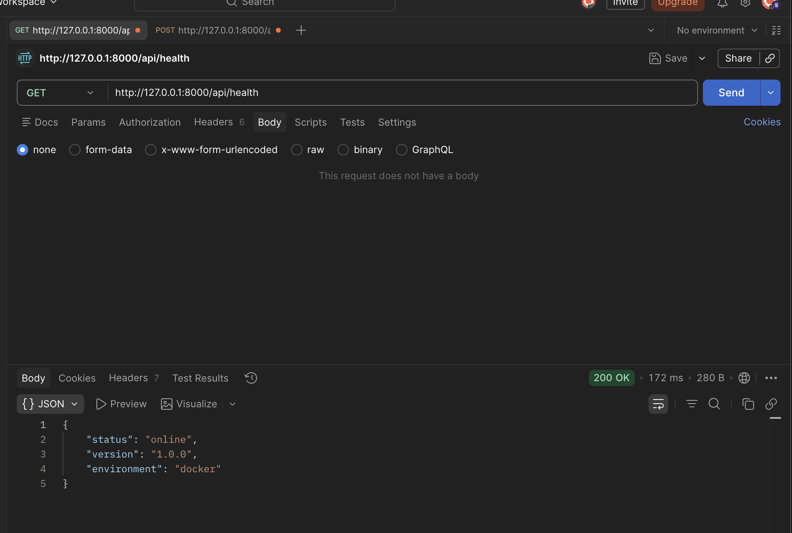
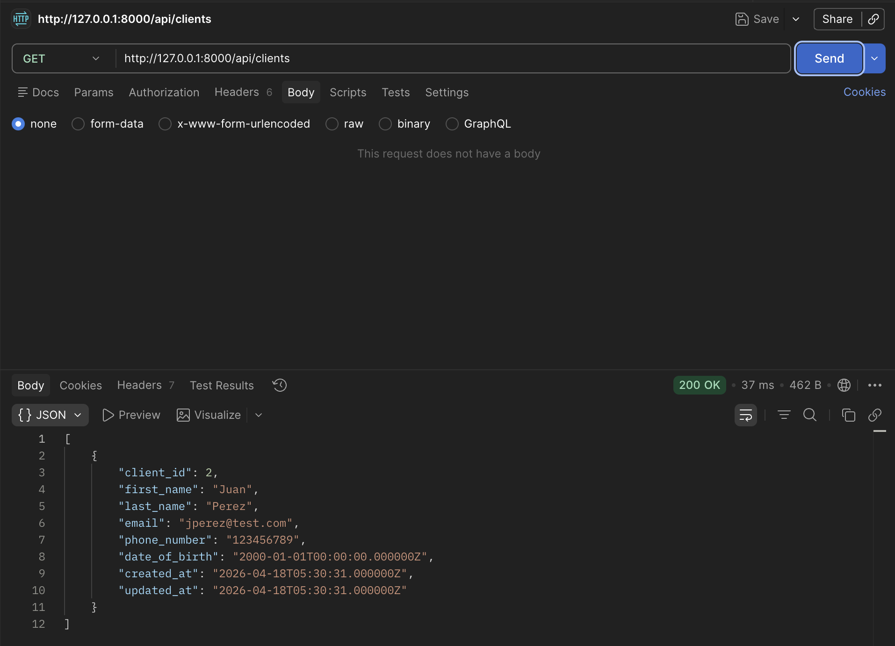
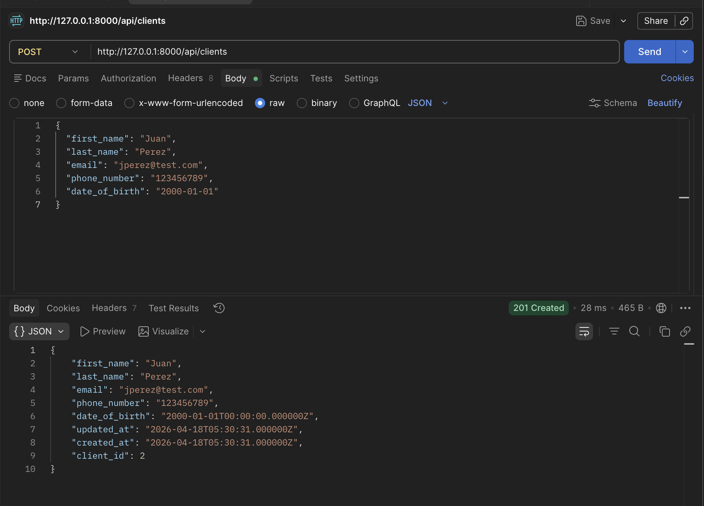

# Evaluation 1 - Backend Development

## Collaborators

- Mixiu Perez
- Andrea Carreño
- Sofia Benavente

## Sprint 0 - Fintech Solutions

## Table of Contents

- [Description](#description)
- [Architecture](#architecture)
- [Request Flow](#request-flow)
- [Backend Role](#backend-role)
- [Database](#database)
- [API](#api)
  - [Health Endpoint](#health-endpoint)
  - [Get Clients](#get-clients)
  - [Create Client](#create-client)
- [ORM Usage](#orm-usage)
- [Project Structure](#project-structure)
- [Conclusion](#conclusion)

## Description

This project was developed as part of Sprint 0 using Laravel as the backend framework.

Its purpose was to apply the fundamental concepts of backend development in a practical setting, including project setup, database connection, and the creation of a functional API.

During implementation, the most relevant challenge was configuring the environment correctly and ensuring stable execution, particularly in relation to the database connection and the initial Laravel bootstrap process.

## Architecture

The project follows the MVC (Model - View - Controller) architecture:

- Model: manages interaction with the database.
- Controller: contains the application logic.
- Routes: define the available endpoints.
- View: in this project, responses are returned in JSON format.

## Request Flow

Client -> Server -> Laravel -> Controller -> Model -> Database -> JSON response

1. The client sends an HTTP request.
2. Laravel receives the request.
3. The request is routed to the corresponding controller.
4. The controller executes the necessary logic.
5. The database is accessed through Eloquent.
6. Laravel returns a structured JSON response.

## Backend Role

The backend is responsible for:

- receiving HTTP requests
- validating input data
- processing business logic
- interacting with the database
- returning structured JSON responses

## How to run the project

Use: php artisan serve 

## How to run migration

Use: php artisan migrate

## Database

MySQL was used as the database management system.

The following table was created:

- `clients`

This table was implemented through Laravel migrations, which provides a clear, repeatable, and maintainable way to manage database structure.

### Migration Example

```php
Schema::create('clients', function (Blueprint $table) {
    $table->id();
    $table->string('first_name');
    $table->string('last_name');
    $table->string('email')->unique();
    $table->string('phone_number');
    $table->date('date_of_birth');
    $table->timestamps();
});
```
Environment to use to connect with database

```php
DB_CONNECTION={{db_connection}}
DB_HOST=127.0.0.1
DB_PORT=3306
DB_DATABASE={{db_database}}
DB_USERNAME={{db_username}}
DB_PASSWORD={{db_password}}
```

### Evidence





## API

### Health Endpoint

#### GET `/api/health`

```json
{
  "status": "online",
  "version": "1.0.0",
  "environment": "docker"
}
```

Expected response: `200 OK`

#### Evidence




### Added bonus to verified consistency with data base table

### 1) Get Clients

#### GET `/api/clients`

Returns all registered clients.

#### Response Example

```json
[
  {
    "id": 1,
    "first_name": "Juan",
    "last_name": "Perez",
    "email": "jperez@test.com",
    "phone_number": "123456789",
    "date_of_birth": "2000-01-01"
  }
]
```

#### Evidence





### 2) Create Client

#### POST `/api/clients`

Creates a new client.

#### Request Example

```json
{
  "first_name": "Juan",
  "last_name": "Perez",
  "email": "jperez@test.com",
  "phone_number": "123456789",
  "date_of_birth": "2000-01-01"
}
```

Expected response: `201 Created`

#### Evidence





## ORM Usage

Eloquent was used to interact with the database.

### Code Example

```php
Client::all();
Client::create($request->all());
```

This approach avoids raw SQL and helps keep the codebase concise and maintainable.

## Project Structure

```text
app/Models                 Models
app/Http/Controllers       Controllers
routes/api.php             API routes
database/migrations        Migrations
config/                    Configuration
public/                    Web access
```

## Conclusion

This project provided a practical introduction to backend development with Laravel, from the initial configuration to endpoint creation and database integration.

The final result was a functional API with the required endpoint and additional endpoints for client management, which made the backend workflow clearer and more applicable to a real-world context.
